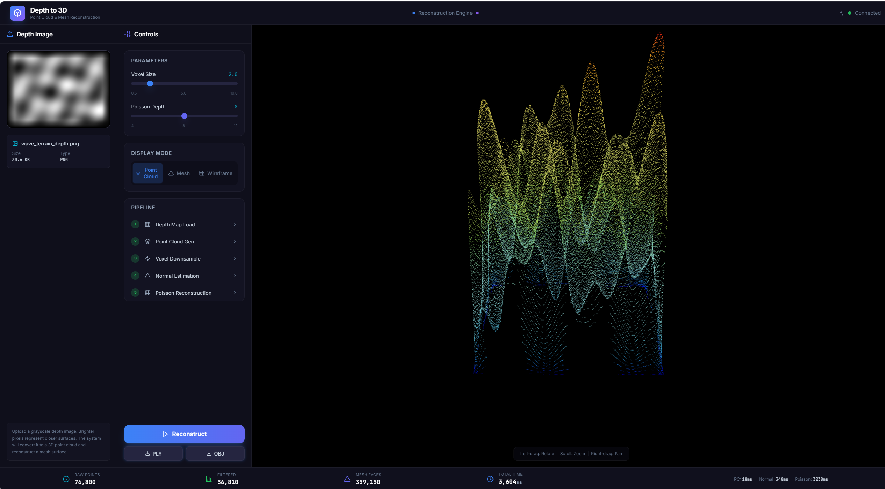

# Depth to 3D — 深度图三维重建 Demo

一个精美的 Web 端深度图三维重建工具。上传或选择预设深度图，自动完成点云生成与 Poisson 网格重建，实时 3D 预览结果。

## 效果展示

本仓库代码效果如下：



## 功能特性

- **样例图库**：内置 6 张高质量深度图样例（球体、立方体、圆柱体、多球组合、波浪地形、螺旋阶梯）
- **深度图上传**：支持拖拽/点击上传 PNG/JPG 灰度深度图
- **三维重建流水线**：
  1. 点云生成（像素坐标直接映射为 3D 点）
  2. 体素降采样 + 统计离群点过滤
  3. 法线估计（k-NN 近邻搜索）
  4. Poisson 表面重建 → 三角网格
- **3D 交互预览**：Three.js 自由旋转/缩放/平移，点云/实体网格/线框三模式切换
- **参数实时调节**：体素大小、Poisson 重建深度
- **导出下载**：PLY（点云）/ OBJ（网格）一键下载
**效果如下：**


## 环境要求

- **Python** >= 3.9
- **Node.js** >= 18
- **npm** >= 9

## 快速开始

### 1. 安装后端依赖

```bash
cd backend
pip install -r requirements.txt
```

### 2. 启动后端服务

```bash
cd backend
python main.py
```

后端服务启动后会自动生成 6 张样例深度图，运行在 `http://localhost:8000`。

### 3. 安装前端依赖

```bash
cd frontend
npm install
```

### 4. 启动前端开发服务器

```bash
cd frontend
npm run dev
```

前端运行在 `http://localhost:5173`，通过 Vite 代理自动将 API 请求转发到后端。

### 5. 打开浏览器

访问 `http://localhost:5173`，选择样例或上传自己的深度图开始体验三维重建！

## 项目结构

```
depth-3d-reconstruction/
├── backend/                    # Python 后端
│   ├── main.py                # FastAPI 入口，API 路由
│   ├── sample_generator.py    # 样例深度图生成器
│   ├── depth_processor.py     # 深度图加载与归一化
│   ├── reconstructor.py       # 核心重建引擎
│   ├── exporter.py            # PLY/OBJ 导出
│   ├── requirements.txt       # Python 依赖
│   ├── samples/               # 自动生成的样例图片
│   └── exports/               # 临时导出文件
├── frontend/                   # React 前端
│   ├── src/
│   │   ├── App.tsx            # 主页面（三栏布局）
│   │   ├── components/
│   │   │   ├── Header.tsx      # 顶部导航栏
│   │   │   ├── SampleGallery.tsx  # 样例图库
│   │   │   ├── UploadPanel.tsx    # 上传面板
│   │   │   ├── ControlPanel.tsx   # 控制面板
│   │   │   ├── Viewer3D.tsx       # 3D 查看器
│   │   │   └── StatsBar.tsx       # 底部统计栏
│   │   ├── hooks/
│   │   │   └── useReconstruct.ts  # 重建 Hook
│   │   ├── services/
│   │   │   └── api.ts            # API 接口
│   │   └── types/
│   │       └── index.ts          # TypeScript 类型
│   ├── package.json
│   └── vite.config.ts
└── README.md
```

## API 接口

| 方法 | 路径 | 说明 |
|------|------|------|
| GET | `/api/health` | 服务健康检查 |
| GET | `/api/samples/list` | 获取样例列表 |
| POST | `/api/reconstruct` | 执行三维重建 |
| POST | `/api/export/ply` | 导出 PLY 点云文件 |
| POST | `/api/export/obj` | 导出 OBJ 网格文件 |

## 样例说明

| 场景 | 深度生成方式 | 几何特征 |
|------|-------------|---------|
| 球体 | 半球面方程 | 连续平滑曲面 |
| 立方体 | 距离场 + 边缘过渡 | 平坦面 + 棱边 |
| 圆柱体 | 径向距离 + Y轴调制映射 | 曲面 + 平面结合 |
| 多球组合 | 三个不同半径球体深度叠加 | 复杂多体场景 |
| 波浪地形 | 多层正弦波叠加 | 连续起伏表面 |
| 螺旋阶梯 | 极坐标角度 + 径向距离 | 高曲率拓扑结构 |

## 技术栈

**前端**：React 18 + TypeScript + Vite + TailwindCSS + React Three Fiber + Drei

**后端**：Python FastAPI + Open3D + OpenCV + NumPy
